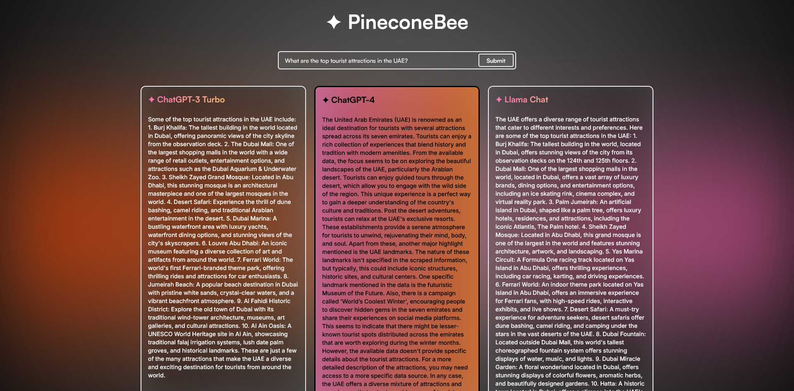

# Description

PineconeBee evaluates multiple LLMs for a user’s question, using similarity‑search over a local knowledge base to score which model produced the most helpful answer. It then returns all model responses with scores and highlights the top pick — in real time via WebSockets.

## Website Preview



## What It Does

- Retrieves relevant context with FAISS (from scraped UAE.gov pages).
- Queries multiple LLMs.
- Scores each answer against a ground‑truth snippet from the same retrieval.
- Returns every model’s score and response, plus the best one.

## How Selection Works

1. Retrieve: Use FAISS to fetch top‑k chunks for the query.
2. Generate: Prompt each configured model with the question + retrieved context.
3. Ground truth: Concatenate the retrieved chunks as an approximate truth reference.
4. Evaluate: Compute a similarity score (token‑overlap baseline) for each answer.
5. Select: Choose the highest‑scoring answer as “most helpful”; return all results.

## Architecture

- Frontend: React (Vite) UI, connects via Socket.IO and displays scores/results.
- Backend: Flask + Flask‑SocketIO for real‑time messaging.
- Retriever: SeleniumURLLoader → OpenAIEmbeddings → FAISS index.
- Models: OpenAI ChatGPT 3.5/4, optional LLaMA via Replicate.
- Evaluator: Token overlap baseline (sklearn) — easy to swap for other metrics.

## Project Structure

```
backend/
  app/
    __init__.py            # create_app(), Socket.IO init, registration
    config.py              # Dev/Prod config
    routes/
      views.py             # HTTP routes (e.g., "/")
    sockets/
      events.py            # Socket.IO events (message in → results out)
    services/
      llm.py               # URLs list, FAISS build, model calls, evaluation orchestration
    evaluation/
      evaluator.py         # Similarity scoring (token overlap)
  scraper/
    scraper.py             # SeleniumURLLoader + FAISS builder
  main.py                  # Entrypoint (runs Flask‑SocketIO server)
frontend/
  src/                     # React app (Form emits message; renders results)
```

## Prerequisites

- Python 3.11+ (3.12 recommended)
- Node.js 18+
- Google Chrome (for Selenium)
- Conda (recommended) or `venv`

## Setup

### Backend

```
cd backend
conda create -n pinecone-bee python=3.12 -y
conda activate pinecone-bee
pip install -r requirements.txt
# Create backend/.env (or use backend/.env.dev) with:
# OPENAI_API_KEY=your_openai_key
# REPLICATE_API_TOKEN=your_replicate_token   # optional
# SECRET_KEY=change-me                        # optional
python main.py   # http://localhost:5000
```

### Frontend

```
cd frontend
npm install
npm run dev
```
